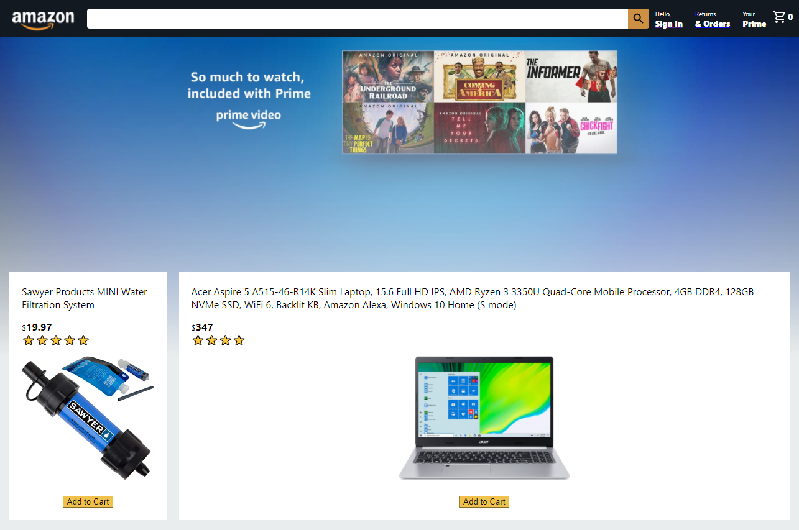

 # 

## Amazon Clone

Amazon Clone is a full stack e-commerce application.  It uses React for the user interface, Google Firebase for it's database and Stripe for payment processing.

Amazon Clone is deployed with Firebase.

## [Go to Amazon Clone](https://clone-14498.web.app/)

&nbsp;

 ## Github: 
 https://github.com/Xr7TSi
 &nbsp;
  #### Email me at jrein1296@gmail.com
  &nbsp;

## License:
  #### Mozilla
  #### https://opensource.org/licenses/MPL-2.0